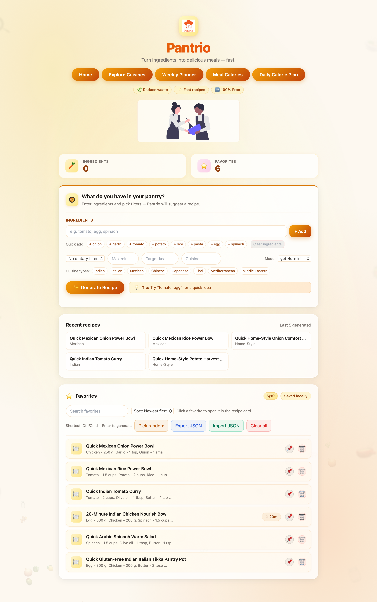
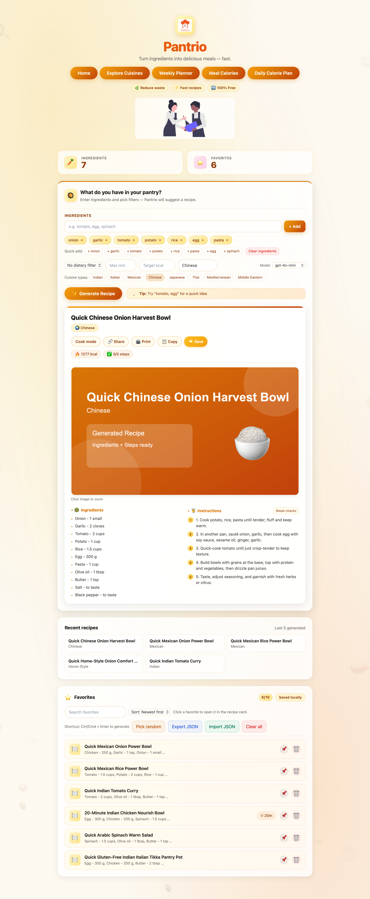
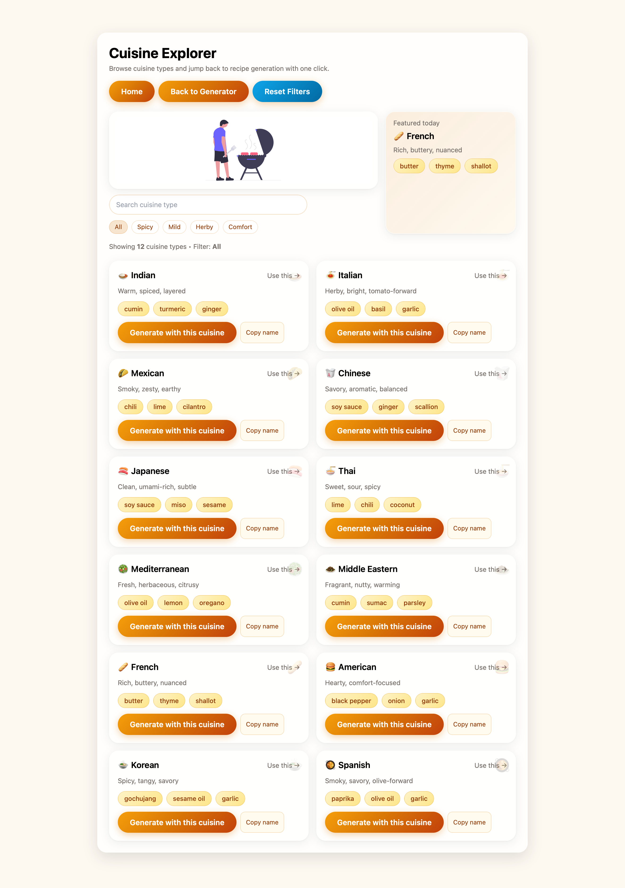
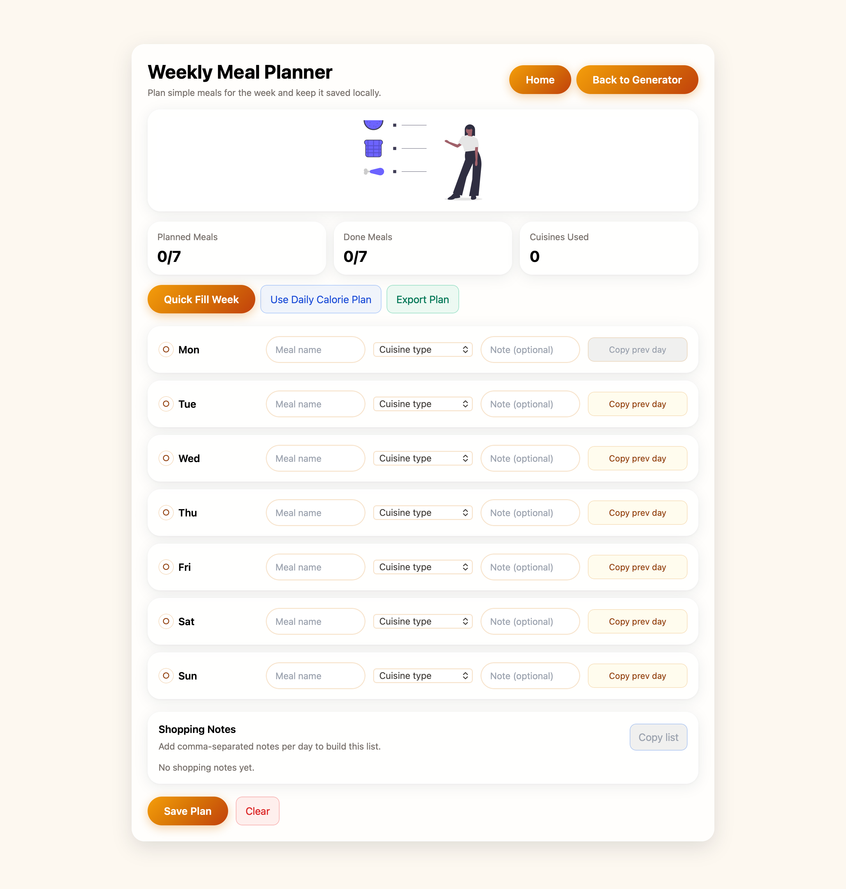
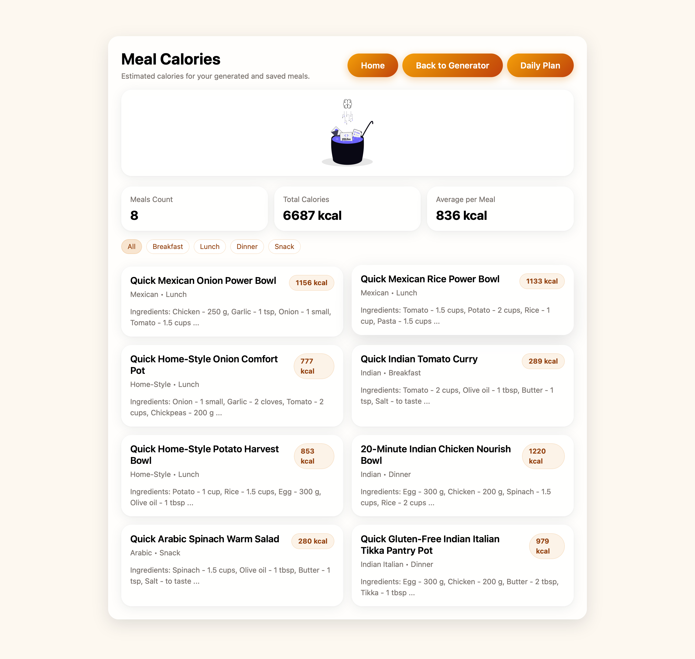
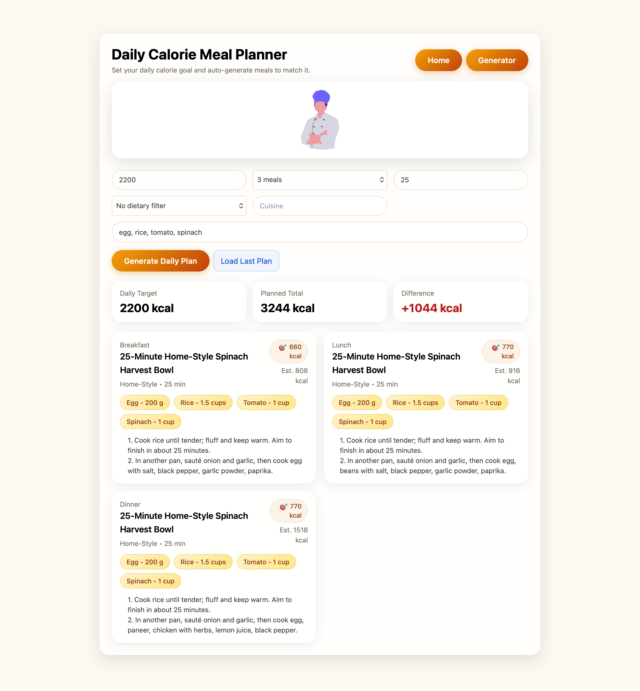

# Pantrio

<p align="center">
	
</p>

Pantrio is a recipe and meal-planning web app that helps users turn pantry ingredients into meal ideas, track favorites, explore cuisines, and plan weekly or calorie-based meals.

## App Preview

### Main Pages

| Home | Generate |
| --- | --- |
|  |  |

| Cuisines | Planner |
| --- | --- |
|  |  |

| Calories | Daily Calories |
| --- | --- |
|  |  |

## Overview

The project is focused on practical meal planning:

- generate recipe ideas from ingredients already on hand
- filter by dietary needs, cuisine, cooking time, and calorie target
- save favorites locally in the browser
- build a weekly meal plan
- create a daily calorie-based meal plan

Everything runs on the frontend with local browser storage for saved data.

## Features

- Pantry-based recipe generation
- Cuisine and dietary filters
- Target calorie recipe generation
- Favorites with local save/import/export
- Recent recipe history
- Weekly meal planner
- Daily calorie planner
- Meal calorie summary page
- Interactive recipe card with copy/share/print/cook mode

## Pages

- `/` — Home
- `/generate` — Recipe generator
- `/cuisines` — Cuisine explorer
- `/planner` — Weekly meal planner
- `/calories` — Meal calories overview
- `/daily-calories` — Daily calorie meal planner

## Tech Stack

- Next.js
- React
- Tailwind CSS
- Local browser storage (`localStorage`)

## Data Storage

Pantrio stores data locally in the browser, including:

- favorites
- recent recipes
- pinned favorites
- weekly meal plan
- daily calorie plan

No account or database setup is required.

## Project Structure

- [pages](pages) — app routes
- [components](components) — reusable UI pieces
- [lib](lib) — recipe and calorie utilities
- [public/img](public/img) — static image assets
- [styles](styles) — global styles

## Running Locally

1. Install dependencies:

```bash
npm install
```

2. Start the dev server:

```bash
npm run dev
```

3. Open:

http://localhost:3000

## Notes

- Images are served from [public/img](public/img).
- Build artifacts: [.next](.next) can be regenerated at any time.


## Future Improvements

- add tests
- improve nutrition accuracy
- support persistent backend storage
- add better mobile interactions
